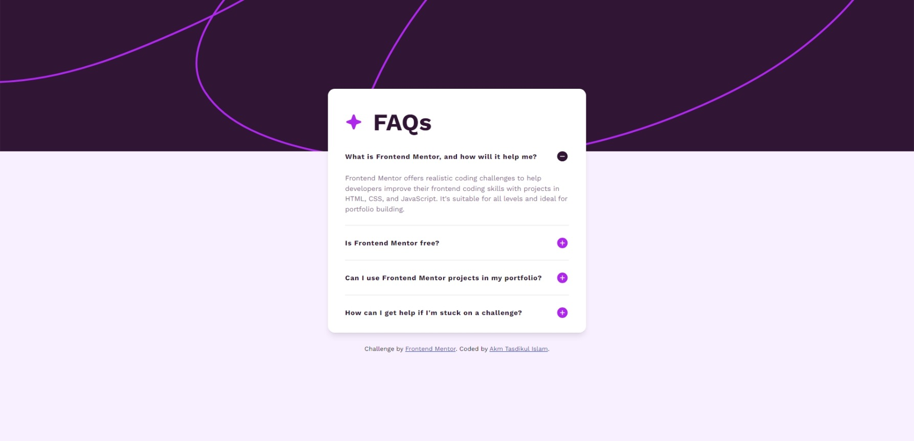
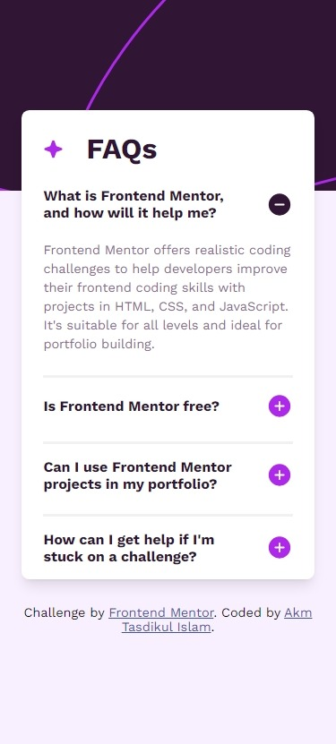

# Frontend Mentor - FAQ accordion solution

This is a solution to the [FAQ accordion challenge on Frontend Mentor](https://www.frontendmentor.io/challenges/faq-accordion-wyfFdeBwBz). Frontend Mentor challenges help you improve your coding skills by building realistic projects.

## Table of contents

- [Overview](#overview)
  - [The challenge](#the-challenge)
  - [Screenshot](#screenshot)
  - [Links](#links)
- [My process](#my-process)
  - [Built with](#built-with)
  - [What I learned](#what-i-learned)
  - [Useful resources](#useful-resources)
- [Author](#author)

## Overview

- Project start date: 04 April 2024
- Project Duration: 3 hours

### The challenge

Users should be able to:

- Hide/Show the answer to a question when the question is clicked
- Navigate the questions and hide/show answers using keyboard navigation alone
- View the optimal layout for the interface depending on their device's screen size
- See hover and focus states for all interactive elements on the page

### Screenshot

| Desktop Version                         | Mobile Version                         |
| --------------------------------------- | -------------------------------------- |
|  |  |

### Links

- [Solution URL:](https://github.com/akmtasdikulislam/faq-accordion)
- [Live Site URL:](https://akmtasdikulislam.github.io/faq-accordion/)

## My process

- At first, I linked the `style.css` file and the Google Fonts CDN with `index.html`.
- Then, imported the colors from `style-guide.md` into the `style.css` file. After that, I initialized the css file and set necessary parameters (such as, font-families, colours, font-sizes etc.) for this project.
- Then, I wrote necessary code to reach the given _UI Design Sample_ and also added necessary css styles to match it with the _UI Design Sample_.
- After that, I wrote the necessary CSS MEDIA QUERIES for mobile device view of this project.
- Finally, I wrote necessary `javascript` codes to toggle open/close state when an accordio is **clicked**.

### Built with

- Semantic HTML5 markup
- CSS custom properties
- Flexbox

### What I learned

By doing this project I learned how to use javascript to create a toggle open/close for an accordion to show its contents.

### Useful resources

- [[JavaScript] - How to create an Accordion with JavaScript resource 1](https://www.shecodes.io/athena/9202-how-to-create-an-accordion-with-javascript#:~:text=The%20JavaScript%20code%20adds%20a,class%2C%20which%20opens%20its%20content.) - This helped me to add toggle open/close feature to accordions.
- [PerfectPixel by WellDoneCode](https://www.welldonecode.com/perfectpixel/) - This extension helped me to match the UI Design Sample as close as possible.

## Author

- Frontend Mentor - [@akmtasdikulislam](https://www.frontendmentor.io/profile/akmtasdikulislam)
- Twitter - [@Akm_Tasdikul](https://www.twitter.com/Akm_Tasdikul)
